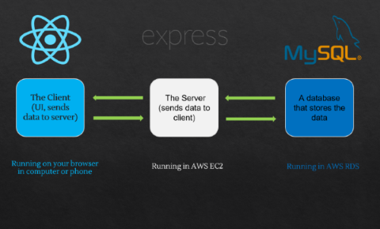

# Siemens Online Seminar & Exhibition

## Table of Content

- [Role & Responsibility](#Role--Responsibility)
- [Demo](#Demo)
- [Project Description](#Project-Description)
- [Work Flow](#Application-Work-Flow)
- [Main Features](#Main-features)
- [Achievement](#Achievement)
- [Note](#note)

# Role & Responsibility

My responsibility was developing the application as a full-stack developer. Collaborating with management, departments, and clients as a project manager.

### My responsibilities in this project include:

- System Design
- Build RESTful APIs in Expressjs
- Admistrate MySQLDB
- AWS Infrastructure Management 
- Create React components (tables, banners, poppers, Modals, buttons and so on)
- Build Admin pages and APIs in Nextjs
- Email, SMS and push notification automation
- Back-up and SQL statement automation using Crontab in Linux
- VOD and Live Streaming
- Handle browser compatibility (Chrome, Safari, Firefox, MS Edge, IE11)
- Responsive Design (Supports mobile devices)
- Data Statistics
- Gitlab Administration
- Collaborate with the clients and review a project proposal

# Application Work Flow

#### This application was built with Reactjs, Expressjs, MysqlDB and AWS.

# Demo

### Website URL

#### [Website URL](https://siemens-evavconference.govent.io/)

While we always allow access to this website, we have closed most of its features since it is not the period of the Event.

# Project Description

This platform was used for the online seminar and exhibition held by [Siemens](https://www.siemens.com/global/en.html), A multinational corporation headquartered in Munich, Germany.

- Development period: 2021.02 ~ 2021.04
- Maintenance period: 2021.02 ~ 2021.11
- Logged users per day: 2,000 ~ 3,000
- Accessed in: 5 countries
- Accessed by: Desktop, Mobile device, Laptop, Tablet
- Accessed on: Chrome, IE, Firefox, Safari, Edge

## Main features

### Branding

### Networking

### Counseling

### Lobby

### Live & VOD Streaming

### Exhibition

### Notice board

### Stamp Event

### This application feels like a real event and offers almost all features that offline events do.

# Achievement

### 1. We have earned their trust.
After the project, we have won five more projects from them.

### 2. I learned how to lead a project.

I was able to understand what are the important jobs for project leader. As a leader, regardless of what your speciality is, you will end up spending a lot of time talking to clients and project members. This includes reviewing the software requirements specification, communicate with team members and other departments to find out if there is an issue in the process. I needed to speak in non-programming terms and suggest an alternative if there's a technical issue. I didn't realise how massive responsibility a leader has. Although all of the responsibilities I had was overwhelming at the beginning, my productivity and collaboration skill gradually increased. I highly believe that I learned and grew up significantly from this experience.

### 3. The CEO offered me a double salary increase with respect for your dedication.

# Some of the biggest projects I've worked on are listed below.

- [IOHA2021 International Scientific Conference](https://ioha2021conference.org/)
- [Unesco International 3D Online Conference](https://iclc2021.govent.io/)
- [Simens Online Conference & Exhibition](https://siemens-evavconference.govent.io) 
- [KHA Online Conference & Exhibition](https://khc2020.salin.co.kr) ( Korean Hospital Association )
- Asia TEFL International 3D Online Conference

# Note

Due to the company policy, I can only open the client-side code.
